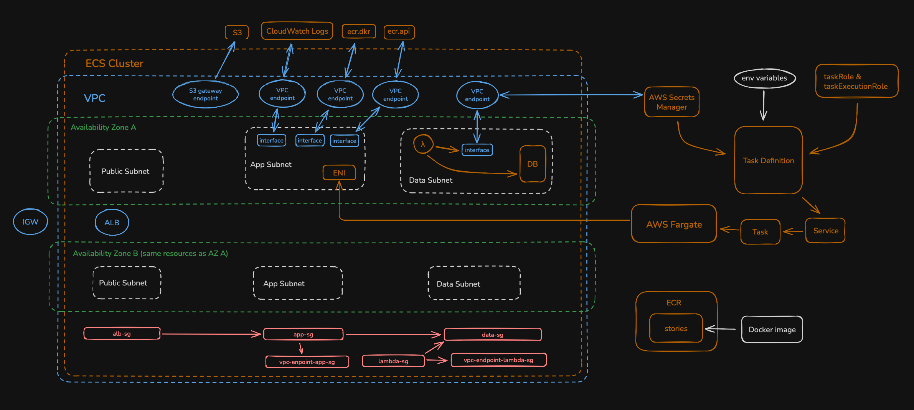

# stories - CI/CD project

Purposose of this project is to implement CI/CD pipeline and document the porses.

## Example app

The project uses simple Spring Boot MVC app with PostgreSQL for data persistence.

## Guide 

[Guide](https://github.com/pinkkila/stories/blob/dev/guide/cicd-guide.md) walks through building a CI/CD pipeline for a containerized application using GitHub Actions and deploying it to AWS Elastic Container Service (ECS) with Fargate. The setup demonstrates how to automate building, containerizing, and deploying your application using AWS and GitHub workflows. 

In addition to the deployment pipeline, the guide includes integration with Amazon RDS for database hosting and AWS Secrets Manager for credential management, including automatic secret rotation using AWS Lambda. The pipeline uses GitHub’s OpenID Connect (OIDC) provider to enable authentication between GitHub Actions and AWS.

## Diagram

