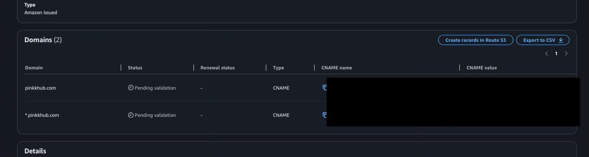
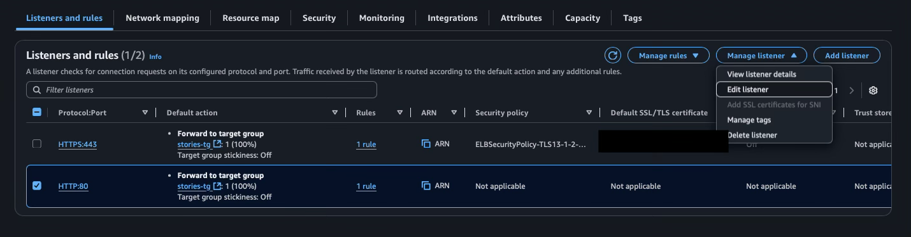

# Deployment on AWS ECS (Fargate) with GitHub Actions CI/CD

This document walks through building a CI/CD pipeline for a containerized application using GitHub Actions and deploying it to **AWS Elastic Container Service (ECS)** with **Fargate**. The setup demonstrates how to automate the build, containerization, and deployment process using AWS and GitHub workflows. Example project uses Spring Boot and part of the document is Spring Boot specific.

In addition to the deployment pipeline, the document includes integration with **Amazon RDS** for database hosting and **AWS Secrets Manager** for credential management, including automatic secret rotation using **AWS Lambda**. The pipeline uses GitHub’s OpenID Connect (OIDC) provider to enable authentication between GitHub Actions and AWS.

⚠️ Disclaimer: I’m a student, not an AWS professional. This document is based on my own learning and experimentation.

### AWS Architecture Diagram

Diagram references: [^1], [^2].


## Preparations

### Spring Boot Actuator

- Spring Boot Actuator can be used to expose a health check endpoint. This will later be used by AWS to verify that the service is running.
- Add the following dependency to your `build.gradle`:

```
    implementation 'org.springframework.boot:spring-boot-starter-actuator' 
```

- Configure Actuator to expose the health endpoint by adding these lines to your `application.yaml`:

```yaml
management:
  endpoints:
    web:
      exposure:
        include: health
```

- Start your application and open the endpoint in a browser or with curl:

```
http://localhost:8080/actuator/health
```

You should see a JSON response like this:

```json
{
  "status": "UP"
}
```

### Spring Cloud AWS Secrets Manager

- Since the database will later be hosted on AWS and its credentials stored in AWS Secrets Manager, the Spring Cloud AWS Secrets Manager dependency provides integration for accessing those credentials.
- Add the dependency to `build.gradle` (For some reason the version number is needed in this particular dependency. Check out the latest version from [Maven Central](https://mvnrepository.com/artifact/io.awspring.cloud/spring-cloud-aws-starter-secrets-manager)):

```
    implementation 'io.awspring.cloud:spring-cloud-aws-starter-secrets-manager:3.4.0'
```

- Create a new configuration file named `application-aws.yaml`.
- You should now have two application files: `application.yaml` (the default profile) and `application-aws.yaml (the aws profile).
- Add the following configuration to `application-aws.yaml`:

```yaml
spring:
  config:
    import: aws-secretsmanager:stories_db-secrets;

  datasource:
    username: ${username}
    password: ${password}
    url: jdbc:postgresql://${host}:${port}/${dbname}
```

- ‼️ Important: Later, when creating the secret in **AWS Secrets Manager**, the secret name must exactly match the one configured here ('stories_db-secrets'). If you want to use a different name (for example, if your app isn’t called stories), update the name accordingly.


## AWS VPC

Section reference: [^1]

- Navigate to the **VPC** dashboard and select "Create VPC":


#### NAT gateway

- [AWS docs](https://docs.aws.amazon.com/vpc/latest/userguide/vpc-nat-gateway.html): *"You can use a NAT gateway so that instances in a private subnet can connect to services outside your VPC but external services can't initiate a connection with those instances."* [^3]. 
- Consider using a NAT Gateway if your application running in a private subnet needs to make outbound server-side connections to external services (for example, calling an external API).
- Client-side requests, such as those from a browser (e.g., Google Fonts or other external APIs called from the frontend), do not require a NAT Gateway because they use the client’s network connection.
- For stories-app, outbound server-side connections are not required, so a NAT Gateway is not selected here. Instead, VPC endpoints are later configured and used to provide private access to AWS services.


#### Subnet naming

- In this document, subnets are named with the 'stories' prefix, since the example application is called *stories*. You can replace this prefix with your own application name to keep your resources organized.
- Include the AWS region and Availability Zone in the name to make it easier to identify where each subnet is located.

- Example naming convention:
  - **eu-north-1a** 
    - stories-public-subnet1-eu-north-1a
    - stories-app-subnet1-eu-north-1a
    - stories-data-subnet1-eu-north-1a

  - **eu-north-1b**
    - stories-public-subnet2-eu-north-1b
    - stories-app-subnet2-eu-north-1b
    - stories-data-subnet2-eu-north-1b


## AWS Security Group 

Section reference: [^1].

- In **VPC** dashboard, go to *Security groups* and select "Create security group" 
- Create following *Security groups*:


## AWS ECR

Section reference: [^1].

- Go to **Elastic Container Registry** and select "Create"


- After the repository is created, go to the repository and select "View push commands"
- Follow those commands to push your image to the repository. (Remember to build your Spring Boot app with the latest changes before pushing: `./gradlew build`)


## AWS RDS

Section reference: [^1].

- Navigate to **Aurora and RDS** dashboard.
- First create a *DB Subnet group*. Select "Create DB subnet group"


- Go to *Databases* in **RDS** dashboard and select "Create database"


- Secrets Manager will be configured later.


- Ensure the port (default 5432 for PostgreSQL) is correct in the *Additional configuration* section (not open in the screenshot).


- In "Additional configuration" add "Initial database name".


- Then select "Create".

- You’ll see a notification containing the master password. Copy it immediately. If you forget, you can reset the password by selecting your DB instance → Modify → "Set a new master password".


## AWS Secrets Manager, Secret rotation with Lambda, VPC endpoint

Section reference: [^1].

- Create the following *Security group*:


- And then edit *stories-data-sg* security group by adding following inbound rule:


- Navigate to the **AWS Secrets Manager** dashboard and select "Store a new secret"


- ‼️ Make sure that "Secret name" matches exatly the one which is configured in the `application-aws.yaml`


- Navigate to the **Lambda** dashboard and select the created Lambda function. 
- Then select "Configuration" and from there select "VPC" and then "Edit" and change *Security group* for "stories-lambda-sg"


- Next create following *Security group* (rest of this section uses reference [^4]):


- Navigate to **VPC** dashboard, go to *Endpoints* and "Create endpoint".


- After the endpoint is created, you can test the secret rotation in **Secrets Manger** under *Rotation* -> "Rotate secrets immediately".


## Target Group

Section reference: [^1].

- Navigate to **EC2** dashboard and go to *Target Groups* and then select "Create target group"


- Remove manually entered IP addresses before continuing.


## Application Load Balancer

Section reference: [^1].

- In the **EC2** dashboard, go to *Load Balancers*, select "Create load balancer", and then choose "Application Load Balancer".


- After reviewing the summary, select "Create load balancer".


## VPC endpoints

Section references: [^5], [^2].

More info: https://docs.aws.amazon.com/vpc/latest/privatelink/privatelink-access-aws-services.html#aws-service-subnets-zones


- The *stories-vpc-endpoint-app-sg* must also be added to the *stories-vpc-endpoint-secrets-manager* endpoint’s security groups, so navigate to that endpoint and select "Manage security groups":


## IAM Roles & Policies

Section reference: [^1].

- Navigate to **IAM** dashboard and go to the *Policies* and select "Create policy".
- Select "Secrets Manager" as a Service:


- From the list check "GetSecretValue":
- If you manage secrets in your app differently than described in this guide, you may also need to add *"secretsmanager:DescribeSecret"* [^4].


- Open another tab, navigate to **Secrets Manager**, select the secret you created earlier, and copy its *Secret ARN*.
- Go back to the policy creation page and select "Add ARNs".
- Paste copied ARN (when you paste ARN other fields will be filled automatically) and then select "Add ARNs". After that select "Next".


- In the **IAM** dashboard go to *Roles* and select "Create role".


## ECS Cluster

Section reference: [^1].

- Navigate to **Elastic Container Service**, go to *Clusters* and select "Create cluster".


## ECS Task definition

Section reference: [^1].

- In **Elastic Container Service** go to *Task definition* and select "Create new task definition".

- ❗️ Select for "Operating system/Architecture" "Linux/ARM64" if you used ARM64 for building image (e.g. Mac with M-series chip).


## ECS Service

Section reference: [^1].

- Navigate to the cluster created earlier and there in the *Services* section select "Create".


- When you press "Create" the deployment will start.
- When deployment is finished, navigate to the **EC2** service and *Load Balancers* and select load balancer created earlier and copy "DNS name" and paste the address to the browser and make sure that your app is running.


## Route 53 and Certificate Manager 

Section reference: [^6], [^7].

- For next step a domain is needed and if you don't have one yet, just navigate to **Route53** dashboard and go to "Register domain".
- If you already have a domain or your registration is finished, navigate to **Certificate Manager** dashboard and then select "Request":


- Next you need to select "Create records in Route 53". 




- Wait and check that certificate is validated and issued.

- Navigate to **EC2** dashboard, then *Load Balancers* and select load balancer that was created earlier. Select "Add listener":


- Navigate *Security groups* and modify alb-sg by adding the https 443:


- Back to the load balancer and on *HTTP:80* select "Edit listener" 




- Back to **Route 53** and in your *Hosted zone details*  select "Create record"


- It might take few a minutes but now your app should be available in both your-domain.com and www<area>.your-domain.com


## OIDC provider

Section reference: [^8].

More info: https://docs.github.com/en/actions/concepts/security/openid-connect#how-oidc-integrates-with-github-actions

- Navigate to the **IAM** dashboard, then *Identity providers*, and select "Add provider" 


- Go to the created Identity provider and select "Assign role"


- Navigate in **IAM** dashboard to the *Policies* section and select "Create policy"
- Select "JSON" and copy and paste the following JSON:


```json
{
	"Version": "2012-10-17",
	"Statement": [
		{
			"Sid": "ManageTaskDefinitions",
			"Effect": "Allow",
			"Action": [
				"ecs:DescribeTaskDefinition",
				"ecs:RegisterTaskDefinition"
			],
			"Resource": "*"
		},
		{
			"Sid": "DeployService",
			"Effect": "Allow",
			"Action": [
				"ecs:DescribeServices",
				"ecs:UpdateService"
			],
			"Resource": [
                "Place your service ARN here! (remove this line❗️)",
				"serviceArn........"
			]
		},
		{
			"Sid": "PassRolesInTaskDefinition",
			"Effect": "Allow",
			"Action": [
				"iam:PassRole"
			],
			"Resource": [
                "Place your taskRoleArn and executionRoleArn here! (remove this line❗️)",
                "taskRoleArn......",
				"executionRoleArn......"
			]
		}
	]
}
```

- Open another tab and navigate to **Elastic Container Serivice** dasboard and then go to the cluster made earlier and from the *Service* section copy your service's ARN and place that to the policy JSON:


- Navigate to the Task definition created earlier and view its JSON. Copy the values of the "taskRoleArn" and  "executionRoleArn" and place them to the policy JSON.
- ‼️ According the [amazon-ecs-deploy-task-definition README](https://github.com/aws-actions/amazon-ecs-deploy-task-definition?tab=readme-ov-file#permissions) you should add both *taskRoleArn* and *executionRoleArn* [^9]. Since the same policy was previously configured for both roles, they are identical — and for that reason, I’ve included only one ARN in the policy JSON. 


- Go back to the *Roles* and go to the role that was created earlier and select "Add permission" and "Attach policies"


## GitHub Secrets

- In your GitHub repository navigate to the *Settings* and select *Secrets and variables*. Then click "New repository secret"


## GitHub Actions

Section reference: [^8], [^9], [^10].

- Next in the project root create directories `.github/workflows` and then add `deploy.yml` to the `workflows` directory.
- Add following lines to the `deploy.yml` 
  - adjust environment (*env*) variables to match your AWS resource names. 
  - Make sure that *database* and *java-version* values also correspond to your project values.
  - In step *Build, tag, and push image to Amazon ECR* check the comment. 

```yaml
name: CI/CD Build & Deploy to ECS

on:
  push:
    branches: [ "main" ]

env:
  AWS_REGION: eu-north-1                                      # set this to AWS region that you are using, e.g. eu-north-1
  ECR_REPOSITORY: stories                                     # set this to your Amazon ECR repository name
  ECS_SERVICE: stories-task-definition-service-kcj0t5mk       # set this to your Amazon ECS service name
  ECS_CLUSTER: stories-ecs-cluster                            # set this to your Amazon ECS cluster name
  CONTAINER_NAME: stories-container                           # set this to the name of the container in the
                                                              # containerDefinitions section of your task definition
  AWS_IAM_ROLE: github-oidc-provider-aws-stories              # set this to your AWS OICD provider role
  ECS_TASK_DEFINITION_FAMILY: stories-task-definition         # set this to your Amazon ECS task definition family
                                                              # (name that was given to the task definition)

permissions:
  contents: read
  id-token: write

jobs:
  build-and-deploy:
    name: Build, test and deploy
    runs-on: ubuntu-latest
    environment: production

    services:
      postgres:
        image: postgres:latest
        env:
          POSTGRES_PASSWORD: secret
          POSTGRES_USER: myuser
          POSTGRES_DB: stories_db
        ports:
          - '5432:5432'

    steps:
    - name: Checkout
      uses: actions/checkout@v4

    - name: Set up JDK 21
      uses: actions/setup-java@v4
      with:
        java-version: '21'
        distribution: 'temurin'

    - name: Setup Gradle
      uses: gradle/actions/setup-gradle@af1da67850ed9a4cedd57bfd976089dd991e2582

    - name: Run tests and build
      env:
        AWS_REGION: eu-north-1
      run: ./gradlew build

    - name: Configure AWS credentials (OIDC)
      uses: aws-actions/configure-aws-credentials@v4
      with:
        audience: sts.amazonaws.com
        aws-region: ${{ env.AWS_REGION }}
        role-to-assume: arn:aws:iam::${{ secrets.AWS_ACCOUNT_ID }}:role/${{ env.AWS_IAM_ROLE }}

    - name: Login to Amazon ECR
      id: login-ecr
      uses: aws-actions/amazon-ecr-login@v2

    - name: Build, tag, and push image to Amazon ECR
      id: build-image
      env:
        ECR_REGISTRY: ${{ steps.login-ecr.outputs.registry }}
        ECR_REPOSITORY: ${{ env.ECR_REPOSITORY }}
        IMAGE_TAG: ${{ github.sha }}
      run: |
        # If your ECS service runs on x86_64 instead of ARM, replace '--platform linux/arm64' with the default:
        # docker build -t $ECR_REGISTRY/$ECR_REPOSITORY:$IMAGE_TAG .
        docker buildx build --platform linux/arm64 -t $ECR_REGISTRY/$ECR_REPOSITORY:$IMAGE_TAG .
        docker push $ECR_REGISTRY/$ECR_REPOSITORY:$IMAGE_TAG
        echo "image=$ECR_REGISTRY/$ECR_REPOSITORY:$IMAGE_TAG" >> $GITHUB_OUTPUT

    - name: Download task definition
      run: |
        aws ecs describe-task-definition \
          --task-definition "${{ env.ECS_TASK_DEFINITION_FAMILY }}" \
          --query 'taskDefinition' > /tmp/app-task-definition.json

    - name: Sanitize task definition
      run: |
        jq 'del(.taskDefinitionArn, .revision, .status, .registeredAt, .registeredBy)' \
          /tmp/app-task-definition.json > /tmp/app-task-definition.sanitized.json

    - name: Fill in the new image ID in the Amazon ECS task definition
      id: task-def-app
      uses: aws-actions/amazon-ecs-render-task-definition@v1
      with:
        task-definition: /tmp/app-task-definition.sanitized.json
        container-name: ${{ env.CONTAINER_NAME }}
        image: ${{ steps.build-image.outputs.image }}

    - name: Deploy Amazon ECS task definition
      uses: aws-actions/amazon-ecs-deploy-task-definition@v2
      with:
        task-definition: ${{ steps.task-def-app.outputs.task-definition }}
        service: ${{ env.ECS_SERVICE }}
        cluster: ${{ env.ECS_CLUSTER }}
        wait-for-service-stability: true
```

- Now when you make a push to the main branch the workflow should start. 


## Workflow for testing

```yaml
name: Run tests or build

on:
  push:
    branches: [ "dev"  ]
  pull_request:
    branches: [ "main", "dev" ]

jobs:
  run-tests-build:
    runs-on: ubuntu-latest
    permissions:
      contents: read

    services:
      postgres:
        image: postgres:latest
        env:
          POSTGRES_PASSWORD: secret
          POSTGRES_USER: myuser
          POSTGRES_DB: stories_db
        ports:
          - '5432:5432'

    steps:
      - uses: actions/checkout@v4

      - name: Set up JDK 21
        uses: actions/setup-java@v4
        with:
          java-version: '21'
          distribution: 'temurin'

      - name: Setup Gradle
        uses: gradle/actions/setup-gradle@af1da67850ed9a4cedd57bfd976089dd991e2582

      - name: Run tests (dev push)
        if: github.event_name == 'push' && github.ref == 'refs/heads/dev'
        env:
          AWS_REGION: eu-north-1
        run: ./gradlew test

      - name: Run tests and build (dev PR)
        if: github.event_name == 'pull_request' && github.base_ref == 'dev'
        env:
          AWS_REGION: eu-north-1
        run: ./gradlew build

      - name: Run tests and build (main PR)
        if: github.event_name == 'pull_request' && github.base_ref == 'main'
        env:
          AWS_REGION: eu-north-1
        run: ./gradlew build
```

### References

[^1]: IAAS Academy. Deploy Applications on AWS Fargate (ECS Tutorial + Hands-On Project): https://www.youtube.com/watch?v=C6v1GVHfOow

[^2]: AWS documentation. Best practices for connecting Amazon ECS to AWS services from inside your VPC: https://docs.aws.amazon.com/AmazonECS/latest/developerguide/networking-connecting-vpc.html

[^3]: AWS documentation. NAT gateways: https://docs.aws.amazon.com/vpc/latest/userguide/vpc-nat-gateway.html

[^4]: AWS documentation. Using an AWS Secrets Manager VPC endpoint: https://docs.aws.amazon.com/secretsmanager/latest/userguide/vpc-endpoint-overview.html

[^5]: AWS documentation. Amazon ECR interface VPC endpoints (AWS PrivateLink): https://docs.aws.amazon.com/AmazonECR/latest/userguide/vpc-endpoints.html

[^6]: Tiny Technical Tutorials. Amazon Route 53 Basics Tutorial | Domain Registration, A Records, CNAME Records, Aliases, Subdomains: https://www.youtube.com/watch?v=JRZiQFVWpi8

[^7]: AWS documentation. Create an HTTPS listener for your Application Load Balancer: https://docs.aws.amazon.com/elasticloadbalancing/latest/application/create-https-listener.html 

[^8]: AWS Community Day. Peter Sankauskas - CI/CD: GitHub Actions to ECS: https://www.youtube.com/watch?v=kHYZX3-EQaw

[^9]: aws-actions. Amazon ECS "Deploy Task Definition" Action for GitHub Actions README: https://github.com/aws-actions/amazon-ecs-deploy-task-definition?tab=readme-ov-file

[^10]: sajosam. GitHub Actions to AWS ECS: Build, Push, and Deploy Docker Images Easily: https://medium.com/@sajo02/github-actions-to-aws-ecs-build-push-and-deploy-docker-images-easily-7d4e8ab3efb6


