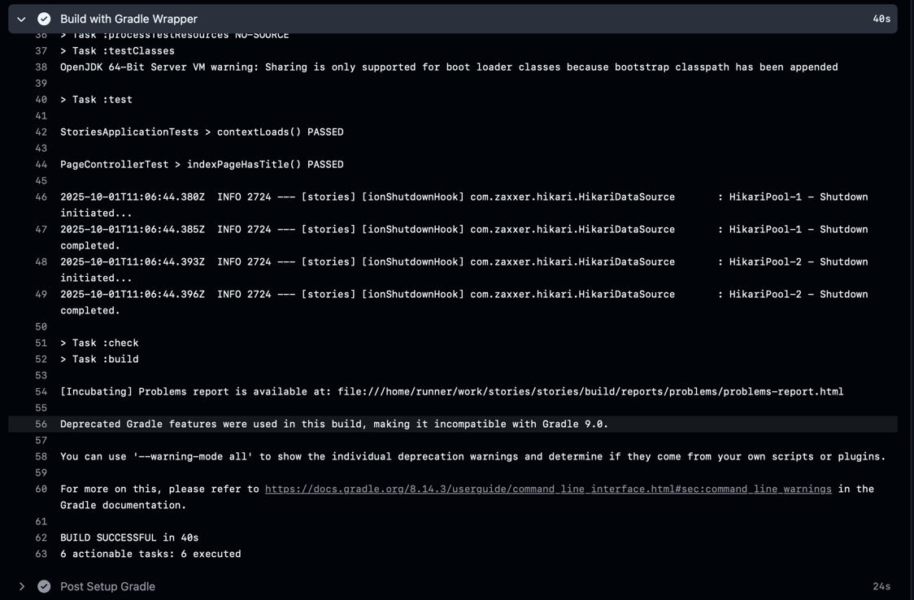
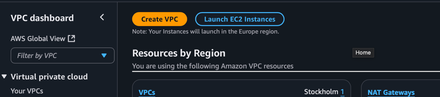
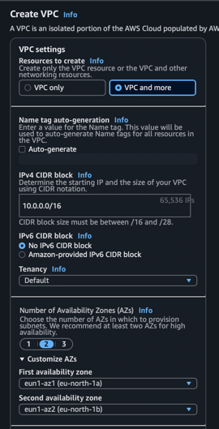
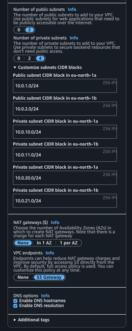
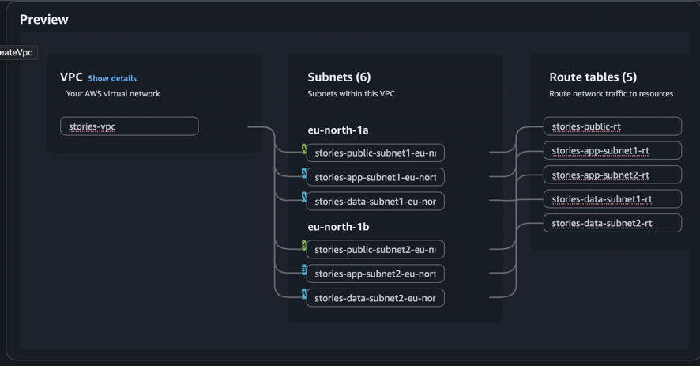
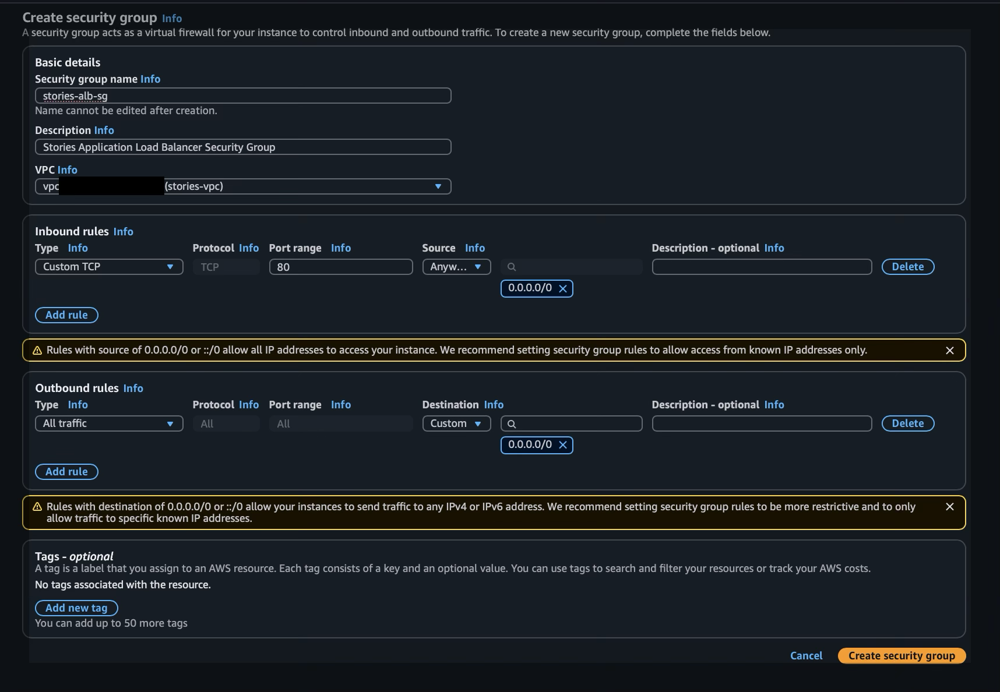
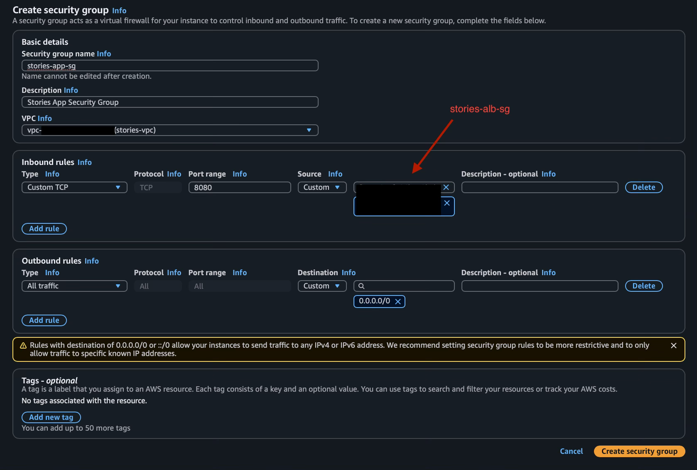
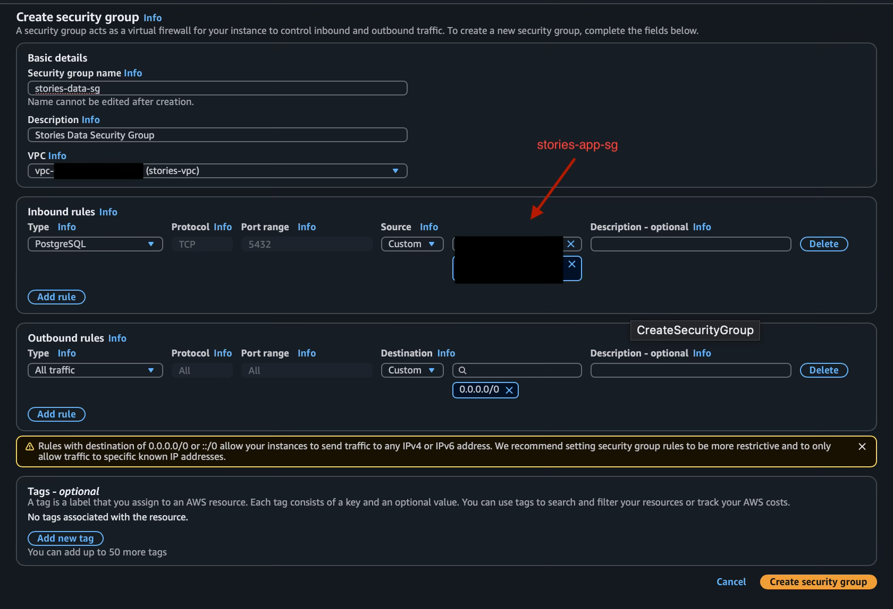
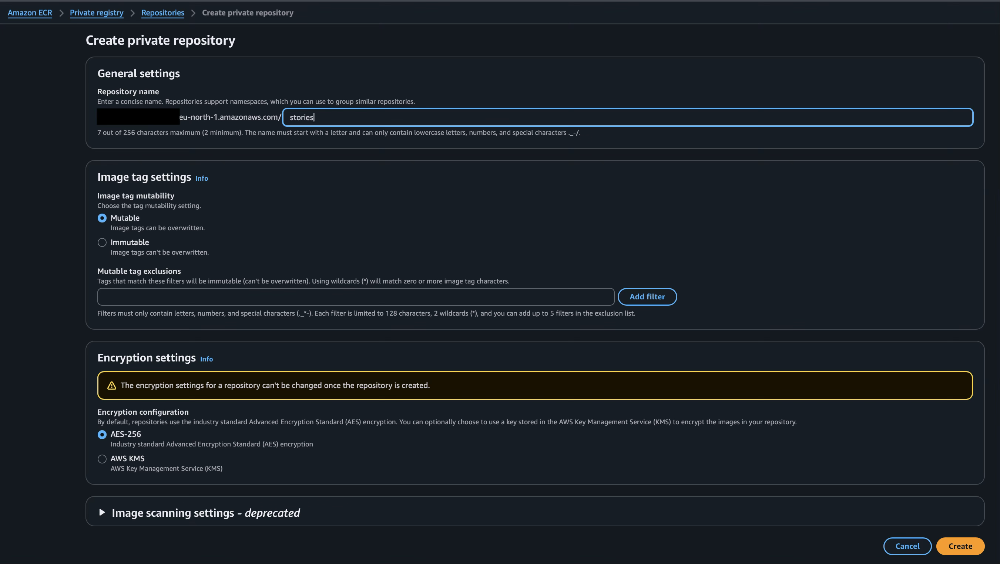

# How to implement CI/CD with AWS 

[//]: # (Todo: Write better info)
This is guide for implementing CI/CD to AWS Fargate with Spring Boot and database using GitHub actions.

## Preparations

### Actuator in Spring Boot app

- We use Actuator to expose endpoint that later tells if the service is up or not.
- Add following dependency to `build.gradle`:
```
    implementation 'org.springframework.boot:spring-boot-starter-actuator' 
```
- Configure Actuator to expose health endpoint by adding following lines to the application.yaml:
```
management:
  endpoints:
    web:
      exposure:
        include: health
```
- Now when you run the app you can check enpoint `http://localhost:8080/actuator/health`, you should get:
```json
{
  "status": "UP"
}
```

### Build with GitHub Actions

- First make sure that your app builds successfully on your local environment, run `./gradlew build`.
- Next in the project root create directories `.github/workflows` and then add `deploy.yml` to the `workflows` directory. 
- Add following lines to the `deploy.yml` (make sure that database and java-version values correspont to your own values):
```yaml
name: Deploy to AWS

on:
  push:
    branches: [ "main" ]
  pull_request:
    branches: [ "main" ]

jobs:
  build:

    runs-on: ubuntu-latest
    permissions:
      contents: read

    services:
      postgres:
        image: postgres:latest
        env:
          POSTGRES_PASSWORD: secret
          POSTGRES_USER: myuser
          POSTGRES_DB: stories_db
        ports:
          - '5432:5432'

    steps:
    - uses: actions/checkout@v4
    - name: Set up JDK 21
      uses: actions/setup-java@v4
      with:
        java-version: '21'
        distribution: 'temurin'

    # Configure Gradle for optimal use in GitHub Actions, including caching of downloaded dependencies.
    # See: https://github.com/gradle/actions/blob/main/setup-gradle/README.md
    - name: Setup Gradle
      uses: gradle/actions/setup-gradle@af1da67850ed9a4cedd57bfd976089dd991e2582 # v4.0.0

    - name: Build with Gradle Wrapper
      run: ./gradlew build
```

- Now you can push the changes to the GitHub and the build should complete successfully. (Above we use `main` branch, but of course you can change it if you want).


- Build with Gradle Wrapper also runs tests (if test fails, the build fails):




### Spring Cloud AWS Secrets Manager in Spring Boot app

- Because we are later hosting database in AWS and use **AWS Secrets Manager** for storing and managing database credentials, we can use Spring Cloud AWS Secrets Manager dependency
- Add dependency to `build.gradle` (For some reason the version number is needed in secrets-manager. Check the latest from Maven Central):
```
    implementation 'io.awspring.cloud:spring-cloud-aws-starter-secrets-manager:3.4.0'
```
- Create a `application-aws.yaml` file.
    - Now you should have two application.yaml files: `application.yaml` and `application-aws.yaml`.
    - application.yaml is automatically used as "default" profile and application-aws is used as "aws" profile.
- Next add following configuration to the `application-aws.yaml`:
```yaml
spring:
  config:
    import: aws-secretsmanager:stories_db-secrets;

  datasource:
    username: ${username}
    password: ${password}
    url: jdbc:postgresql://${host}:${port}/${dbname}
```

- ‼️Later we are going to create secret in the AWS Secrets Manager service and the secret name that we define there must be excatly same that is configured here ("stories_db-secrets"). If you want to give secret different name (e.g. your app name is not stories) write the secret name that you want to use. 

- Now when make a push to the GitHub the build fails:
```
        Caused by:
        org.springframework.beans.factory.BeanCreationException: Error creating bean with name 'secretsManagerClient' defined in class path resource [io/awspring/cloud/autoconfigure/config/secretsmanager/SecretsManagerAutoConfiguration.class]: Failed to instantiate [software.amazon.awssdk.services.secretsmanager.SecretsManagerClient]: Factory method 'secretsManagerClient' threw exception with message: Unable to load region from any of the providers in the chain software.amazon.awssdk.regions.providers.DefaultAwsRegionProviderChain@1e295f7f: [software.amazon.awssdk.regions.providers.SystemSettingsRegionProvider@713497cd: Unable to load region from system settings. Region must be specified either via environment variable (AWS_REGION) or  system property (aws.region)., software.amazon.awssdk.regions.providers.AwsProfileRegionProvider@63318b56: No region provided in profile: default, software.amazon.awssdk.regions.providers.InstanceProfileRegionProvider@19e5e110: Unable to retrieve region information from EC2 Metadata service. Please make sure the application is running on EC2.]
```

- Like the log suggest, modify `deploy.yml` so that there is **AWS_REGION** as an evn parameter:

```yaml
    - name: Build with Gradle Wrapper
      env:
        AWS_REGION: eu-north-1
      run: ./gradlew build
```


## AWS VPC

- Go to VPC dashboard and select Create VPC:







#### Subnet names

- I use "stories" prefix here because it is the name of the app.
- Put region that you are using.

- **eu-north-1a** 
  - stories-public-subnet1-eu-north-1a
  - stories-app-subnet1-eu-north-1a
  - stories-data-subnet1-eu-north-1a

- **eu-north-1b**
  - stories-public-subnet2-eu-north-1b
  - stories-app-subnet2-eu-north-1b
  - stories-data-subnet2-eu-north-1b



- Select "Create VPC"

- ❗️When you create VPC **Elastic IP** is created. When you remove the VPC remember to release Elastic IP address. 


## AWS Security Group 

- Create following Security Groups **VPC -> Security Groups -> Create security group**








## AWS ECR

- Go to **Elastic Container Registry** and select **Create**



- After repository is created go to repository and select **View push commands**
- Folow those commands and push image to the repository. (Remember build your Spring app with lates changes before push).


## AWS RDS


